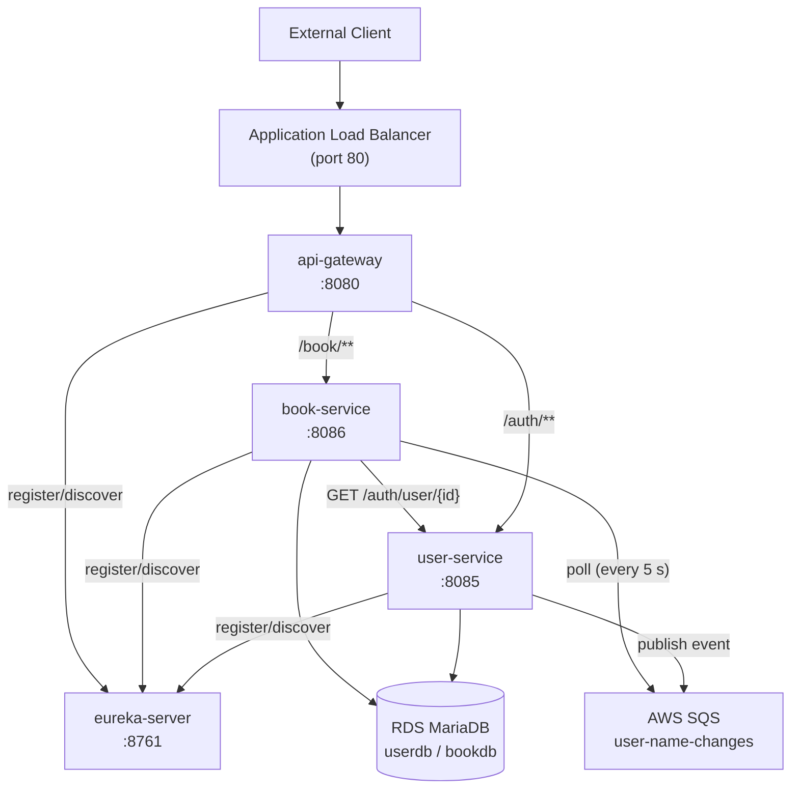

# Technical Report — Spring Cloud Library (SWE455)

## 1. Project Overview

Spring Cloud Library is a production-grade library management backend built as a set of microservices. It handles user authentication, book catalog operations, and event-driven name-change propagation. The system runs on AWS using ECS Fargate containers, with full CI/CD automation via GitHub Actions and infrastructure managed entirely by Terraform.

---

## 2. Architecture Description

The application consists of four services:

| Service | Port | Responsibility |
|---|---|---|
| **eureka-server** | 8761 | Netflix Eureka service registry |
| **api-gateway** | 8080 | Spring Cloud Gateway MVC — routes `/auth/**` and `/book/**` |
| **user-service** | 8085 | Signup, login, JWT issuance, user status & name management |
| **book-service** | 8086 | Book CRUD, polymorphic book types, SQS consumer |

External clients reach the system exclusively through the Application Load Balancer (ALB). Traffic flows: `Client → ALB → api-gateway → user-service / book-service`. Services discover each other via Eureka using load-balanced RestTemplate.

User name-change events are published to an AWS SQS queue by user-service and consumed by book-service via a scheduled poll, replacing the original Kafka dependency.

---

## 3. Architecture Diagram



---

## 4. Cloud Resources (Terraform-provisioned)

| Resource | Purpose |
|---|---|
| VPC + Subnets | Network isolation; public subnets for ALB, private for ECS + RDS |
| Internet Gateway + NAT Gateway | Internet access for public subnet; outbound-only for private |
| Application Load Balancer | Single public entry point; routes `/auth/*` and `/book/*` |
| ECS Fargate Cluster | Serverless container runtime |
| 4× ECS Task Definitions | One per service, Java 21 images |
| 4× ECS Services | `desired_count = 1`; `force_new_deployment = true` |
| 4× ECR Repositories | Docker image storage with lifecycle cleanup |
| RDS MariaDB 10.11 | Managed relational DB in private subnet |
| SQS Queue | Async user-name-change event bus |
| 4× CloudWatch Log Groups | Centralised structured logs |
| IAM Roles + Policies | Task execution (ECR pull, CW logs) + Task (SQS access, SSM read) |
| SSM Parameter Store | `DB_PASSWORD` and `JWT_SECRET` stored as SecureString |
| Security Groups | Strict least-privilege: ALB → ECS → RDS |

---

## 5. CI/CD Pipeline

On every `push` to `main`:

1. **Checkout** — source cloned.
2. **Java 21 + Maven cache** — dependencies downloaded once.
3. **`mvn clean package -DskipTests`** — all four fat JARs built.
4. **OIDC authentication** — ephemeral AWS credentials via `aws-actions/configure-aws-credentials`; no long-lived keys in GitHub.
5. **ECR login** — `aws-actions/amazon-ecr-login`.
6. **Docker build & push** — each service tagged with git SHA and `latest`.
7. **Terraform init/validate/apply** — infra changes applied; `TF_VAR_ecr_image_tag` injects the new SHA.
8. **ECS force redeploy** — `aws ecs update-service --force-new-deployment` ensures containers restart.
9. **Summary** — ALB DNS printed to the job summary.

---

## 6. 15-Factor Methodology

| Factor | Implementation |
|---|---|
| **I. Codebase** | Single Git repository; one codebase deployed to all environments |
| **II. Dependencies** | All dependencies declared in `pom.xml`; no implicit system packages |
| **III. Config** | All environment-specific config in environment variables (`DB_HOST`, `JWT_SECRET`, etc.) |
| **IV. Backing services** | MariaDB and SQS treated as attached resources, referenced via env vars |
| **V. Build/Release/Run** | Maven produces immutable JARs → Docker image (release) → ECS service (run) |
| **VI. Processes** | Stateless Spring Boot processes; all state in MariaDB or SQS |
| **VII. Port binding** | Each service exports via `server.port`; no runtime injection of HTTP server |
| **VIII. Concurrency** | ECS desired_count can be scaled per service independently |
| **IX. Disposability** | Graceful shutdown enabled (`server.shutdown=graceful`, 30 s timeout); fast start with layered Docker images |
| **X. Dev/Prod parity** | Same Docker images in docker-compose (local) and ECS (prod); LocalStack emulates SQS locally |
| **XI. Logs** | All services write to stdout/stderr; captured by CloudWatch Logs |
| **XII. Admin processes** | DB schema managed via `hibernate.ddl-auto=update`; one-off tasks can be run as ECS run-task |
| **XIII. API first** | REST API documented in `docs/api-documentation.md`; contract-driven |
| **XIV. Telemetry** | Spring Boot Actuator `/actuator/health` on all services; CloudWatch metrics via container insights |
| **XV. Auth** | JWT-based stateless authentication; secrets stored in SSM Parameter Store |

---

## 7. Deployment Instructions

### Prerequisites

- AWS account with sufficient IAM permissions
- AWS CLI configured: `aws configure`
- Terraform ≥ 1.5: `terraform version`
- Docker Desktop running
- Java 21 + Maven

### First-time deploy

```bash
# 1. Clone the repo
git clone <repo_url>
cd SpringCloudLibraryPreAuthorized

# 2. Configure Terraform variables
cp infra/terraform.tfvars.example infra/terraform.tfvars
# Edit infra/terraform.tfvars with your values

# 3. Build JARs
mvn clean package -DskipTests

# 4. Init and deploy infrastructure
cd infra
terraform init
terraform apply

# 5. Get the ALB DNS name
terraform output alb_dns_name

# 6. Build and push Docker images (replace ACCOUNT_ID and REGION)
cd ..
REGISTRY="<ACCOUNT_ID>.dkr.ecr.<REGION>.amazonaws.com"
aws ecr get-login-password | docker login --username AWS --password-stdin $REGISTRY

for SERVICE in eureka-server api-gateway user-service book-service; do
  docker build -t "${REGISTRY}/library-prod/${SERVICE}:latest" ./${SERVICE}
  docker push "${REGISTRY}/library-prod/${SERVICE}:latest"
done

# 7. Force ECS redeployment
for SERVICE in eureka-server api-gateway user-service book-service; do
  aws ecs update-service --cluster library-prod-cluster --service $SERVICE --force-new-deployment
done
```

### Subsequent deploys

Push to `main` — the GitHub Actions workflow handles everything automatically.

---

## 8. Destroy and Restore Demo

### Destroy (complete teardown in ~5 minutes)

```bash
cd infra
terraform destroy -auto-approve
```

This removes all AWS resources: ECS cluster, ALB, RDS, SQS queue, ECR repos, VPC.

### Restore from scratch

```bash
cd infra
terraform apply -auto-approve
# Then push to main (or manually re-push images and force ECS redeploy as above)
```

The system returns to a working state without any manual AWS Console intervention.

---

## 9. Local Development

```bash
# Build JARs first
mvn clean package -DskipTests

# Start all services
docker-compose up --build

# Verify
curl http://localhost:8080/auth/signup -X POST \
  -H "Content-Type: application/json" \
  -d '{"username":"admin","email":"a@a.com","firstName":"Ad","lastName":"Min","password":"pass"}'
```

Services: Eureka (`8761`), Gateway (`8080`), User (`8085`), Book (`8086`), LocalStack (`4566`).

---

## 10. Testing

```bash
# 1. Sign up
curl -X POST http://localhost:8080/auth/signup \
  -H "Content-Type: application/json" \
  -d '{"username":"testuser","email":"t@t.com","firstName":"Test","lastName":"User","password":"pass"}'

# 2. Log in (admin must be seeded or status changed)
TOKEN=$(curl -s -X POST http://localhost:8080/auth/login \
  -H "Content-Type: application/json" \
  -d '{"username":"testuser","password":"pass"}' | jq -r '.message')

# 3. Activate account (requires admin token)
# curl -X POST http://localhost:8080/auth/change-status ...

# 4. Add a book (admin + active)
curl -X POST http://localhost:8080/book/add \
  -H "Authorization: Bearer $TOKEN" \
  -H "Content-Type: application/json" \
  -d '{"type":"PrintedBook","ISBN":"1232","title":"Test Book","author":"Author","genre":"Fiction","numOfPages":200,"hardcover":false}'

# 5. List books
curl -H "Authorization: Bearer $TOKEN" http://localhost:8080/book/all
```

---

## 11. Known Limitations

- **Single-AZ NAT Gateway** — cost-optimized for a demo; production should use multi-AZ.
- **`desired_count = 1`** — no horizontal scaling configured; add auto-scaling for production load.
- **HTTP only** — no TLS termination on the ALB; add an ACM certificate and HTTPS listener for production.
- **Eureka in ECS** — service discovery via Eureka works but AWS Cloud Map is a more native option.
- **`ddl-auto=update`** — acceptable for demo; use Flyway/Liquibase for production schema migrations.
- **No admin seeding** — a user must be manually promoted to `ROLE_ADMIN` via direct DB update after first signup.

---

## 12. AI Prompt Appendix

See [`../prompts/01-project-build.md`](../prompts/01-project-build.md) for the complete prompt used to generate this project structure.
